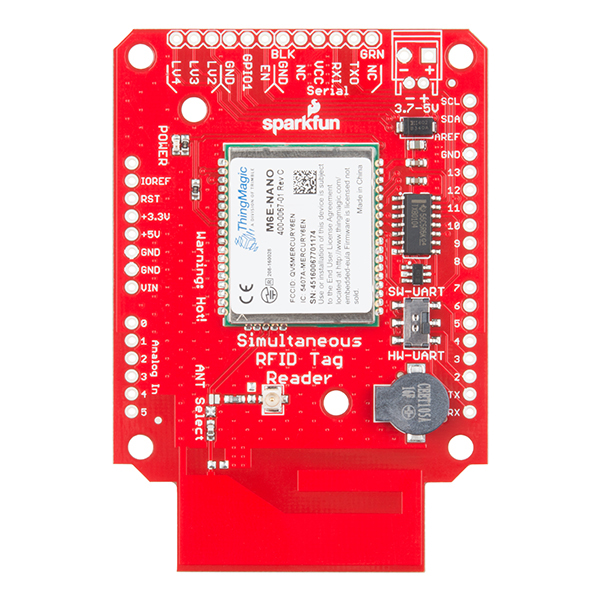
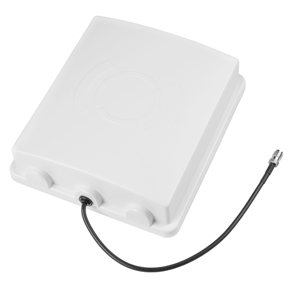
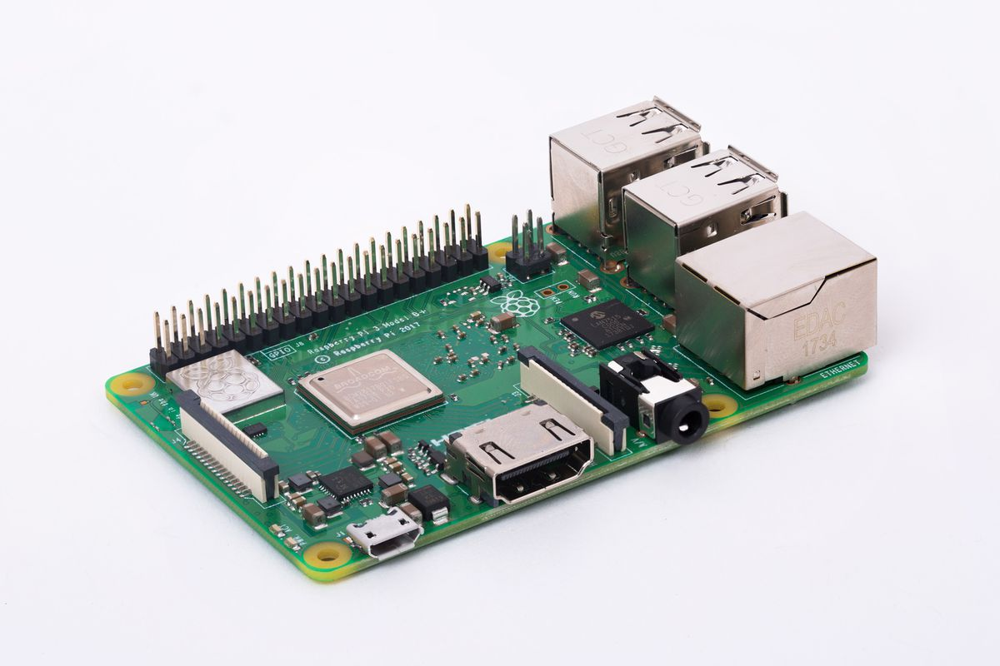

# RFID_Tool_Tracking_System

## Introduction
The project was initiated as part of Tech challenge conducted by Unternehmertum at the Technical University of Munich. By the end of the competition (three months duration), the suggested prototype was completed and the working prototype was presented at the Demo Day. Team Nostos also won the Makerspace track of the Tech Challenge competition and also got invited by Mr. Matthias Friessnig, Managing Director - Makerspace, to implement the Nostos solution in Makerspace. The Nostos System keeps track of all the tools/personnal in the monitored area. The system has been implemented using a 5-level IoT Architecture and the user interface is accessible from any device which is capable of accessing a webpage.


## Principle

The RFID based tool tracking system works on **passive UHF RFID technology**.

### Conventional Asset Tracking Systems
In conventional tool/asset tracking systems, they employ multiple RFID readers to implement tracking. The RFID readers send signals which are received by the tags which are attached to the tools and then the tags respond back by sending back a signal. The response signal is received by the RFID readers and then the values are triangulated or trilaterated to obtain the exact location of the tool. This is similiar to how the location of a mobile is located using three signal towers.

#### Drawbacks
The conventional systems need multiple RFID readers and each of these readers cost a lot (atleast 200$ - https://www.sparkfun.com/products/14066). So when larger the area to be covered, more will be the number of readers required. And so the cost increases exponentially. When implementing an asset tracking system in a workplace like Makerspace which has 1500 m2 area, the number of reader required will be atleast 10 and hence, the cost will be around 2000$ just for the readers. This is where the idea of the **Nostos** RFID solution becomes appreciable.

## Nostos RFID based Asset Tracking System


The Nostos RFID solution uses only one RFID reader irrespective of the area to be covered. The different components of the Nostos solution are:
- The moving robot suspended on an overhead suspended lift system
- UHF RFID reader mounted on the Nostos Robot
- Wifi Module (ESP8266) mounted on the Nostos Robot
- IoT gateway (Raspberry Pi)

1. Nostos Robot
  The Nostos Robot is suspended on a continously moving lift system. The lift system is driven by a motor which is plugged into a wall plug. The Nostos Robot houses most of the components in the Nostos solution. It mainly has
    - Arduino Microcontroller which is the brain of the Robot
    - UHF RFID Reader which tracks the tools and sends the received information from the tool/tag back to the Arduino.
    - UHF RFID Antenna for increasing the range of the reader
    - ESP8266 WiFi Module which collects the data received from the RFID Reader via the Arduino and then sends the data to the IoT Gateway using MQTT (an Internet of Things Communication Protocol)
    - LiPo Battery which powers all the components on the Nostos Robot

2. UHF RFID Reader
  The RFID Reader is an arduino shield which is attached to the Arduino Microcontroller to send and receive the data. The RFID reader can work in two different modes:
    - Continous Scan
    - Intermittent Scan
  

  Both the modes of operations consume different amounts of power and depending on the signal from the Arduino, the reader can work in the corresponding mode.

  ``` The RFID Reader is capable of performing 150 simultaneous tag reads which means that in a fraction of a second it can read the data from 150 tools/tags```

3. UHF RFID Antenna
  The RFID Antenna is used to increase the reading range of the Reader. Without an external antenna, the range of the reader is limited to a few centimetres. But with the antenna, the reader can read upto a maximum range of 5 metres.

  *On demo day, the range of the antenna was tested upto a range of 3 metres.

  


4. ESP8266 Wifi Module
  The data received from the RFID reader is sent to Arduino which further transmits it to the WiFi module. The WiFi module takes the relevant information and transmits it wirelessly to Raspberry Pi.

  

5. IoT Gateway
  The Raspberry Pi acts as the IoT Gateway. It collects the wireless data from the WiFi module and then displays the corresponding information on the IoT Dashboard.

  

 
